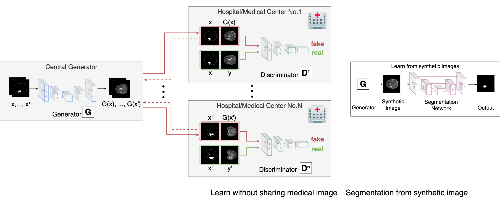

# AsynDGAN in pyTrorch

## Synthetic Learning: Learn From Distributed Asynchronized Discriminator GAN Without Sharing Medical Image Data

[Qi Chang1*](https://github.com/tommy-qichang/AsynDGAN), [Hui Qu1*](https://github.com/huiqu18), [Yikai Zhang1*](https://github.com/hazaiisme), Mert Sabuncu2,
Chao Chen3, Tong Zhang4 and Dimitris Metaxas2
{qc58,hq43,yz422,dnm}@cs.rutgers.edu , msabuncu@cornell.edu, chao.chen.cchen@gmail.com, tongzhang@tongzhang-ml.org

## Abstract

In this paper, we propose a data privacy-preserving and communication efficient distributed GAN learning frame- work named Distributed Asynchronized Discriminator GAN (AsynDGAN). Our proposed framework aims to train a cen- tral generator learns from distributed discriminator, and use the generated synthetic image solely to train the seg- mentation model. We validate the proposed framework on the application of health entities learning problem which is known to be privacy sensitive. Our experiments show that our approach: 1) could learn the real image’s distri- bution from multiple datasets without sharing the patient’s raw data. 2) more efficient and requires lower bandwidth than other distributed deep learning methods. 3) achieve higher performance compared to the model trained by one real dataset, and almost the same performance compared to the model trained by all real datasets. 4) proofs that the generator could learn the distributed distribution in an all important fashion thus has an unbiasedness guarantee.

In CVPR 2020 [[bibtex]](docs/bibtex)

## Requirements:

- pytorch 0.4+
- python 3.6.8
- visdom 0.1.8.8
- pillow 5.4.1

## Acknowledgments
Our code borrows heavily from the the pix2pix implementation [pytorch-CycleGAN-and-pix2pix](https://github.com/junyanz/pytorch-CycleGAN-and-pix2pix/.)

